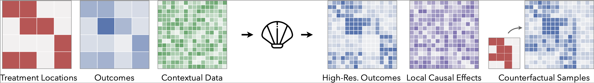

# CLAM: Causal Spatial Disaggregation

  

## Overview

**CLAM** (Causal Spatial Disaggregation) estimates **fine-grained causal effects** from **coarse-resolution intervention–outcome data** using high-resolution covariates. It enables:

- Recovering local treatment effects from aggregated outcomes  
- Counterfactual reasoning under hypothetical interventions  
- Handling unknown aggregation functions and hidden confounders  

Relevant for **public health, environmental policy, and social sciences**, where interventions act at large scales but effects vary locally.

## Getting Started

All experiments from the paper are implemented in a **single Jupyter notebook**:

[Open the notebook](./Causal_disaggregation_shared.ipynb)

The notebook covers:
- Political campaigning (heterogeneous effects by demographics)  
- Unknown intervention locations  
- Hidden confounders  
- Unknown aggregation functions  
- Confounded treatment assignment  
