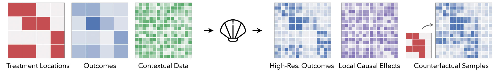

  

# CLAM: Causal Spatial Disaggregation

  

## Overview

**CLAM** — the **Causal Spatial Disaggregation Method** — estimates fine-grained causal effects from coarse-resolution intervention and outcome data by leveraging high-resolution covariates.

Many real-world interventions are applied and measured at broad spatial scales, while their effects vary locally. CLAM addresses this mismatch by jointly learning a local causal mechanism and a disaggregation mapping, enabling:

- estimation of local treatment effects from aggregated outcomes,
- counterfactual reasoning under hypothetical interventions,
- outcome disaggregation from coarse to fine spatial resolution,
- extensions to settings with unknown aggregation functions, latent intervention locations, or hidden confounders.

This is particularly relevant in domains such as **public health**, **environmental policy**, **education**, and the **social sciences**, where decisions are often made at coarse spatial scales despite substantial local heterogeneity. The method paper describes CLAM as a framework for estimating localized causal effects, performing counterfactual reasoning, and disaggregating outcomes from coarse observations using high-resolution contextual covariates.

## Getting Started

The synthetic experiments from the paper are implemented in a single Jupyter notebook:

[Open the synthetic experiments notebook in Colab](https://colab.research.google.com/github/DSanonym/clam/blob/main/synthetic_experiments.ipynb)

The notebook covers:

- political campaigning with heterogeneous effects by demographics,
- unknown intervention locations,
- hidden spatial confounders,
- unknown aggregation functions,
- confounded treatment assignment.

You can run the notebook directly in Google Colab by opening the link above.

## Semi-Synthetic Experiment

The semi-synthetic real-world experiment is provided in a separate Jupyter notebook:

[Open the real-world experiment notebook in Colab](https://colab.research.google.com/github/DSanonym/clam/blob/main/real_world_data_experiment/realworld_experiment.ipynb)

This experiment uses compiled real-world data sources and requires the accompanying data file to be unpacked and uploaded before running the notebook. The compiled dataset is approximately **800 MB** as a CSV file.

Please do not use the real-world data without citing the original data sources:

- [Gun Violence Archive](https://www.gunviolencearchive.org/)
- [AlphaEarth Foundations](https://deepmind.google/blog/alphaearth-foundations-helps-map-our-planet-in-unprecedented-detail/)

## Citation

If you use CLAM, the notebooks, or the compiled real-world data in your work, please cite the corresponding paper and the relevant original data sources.